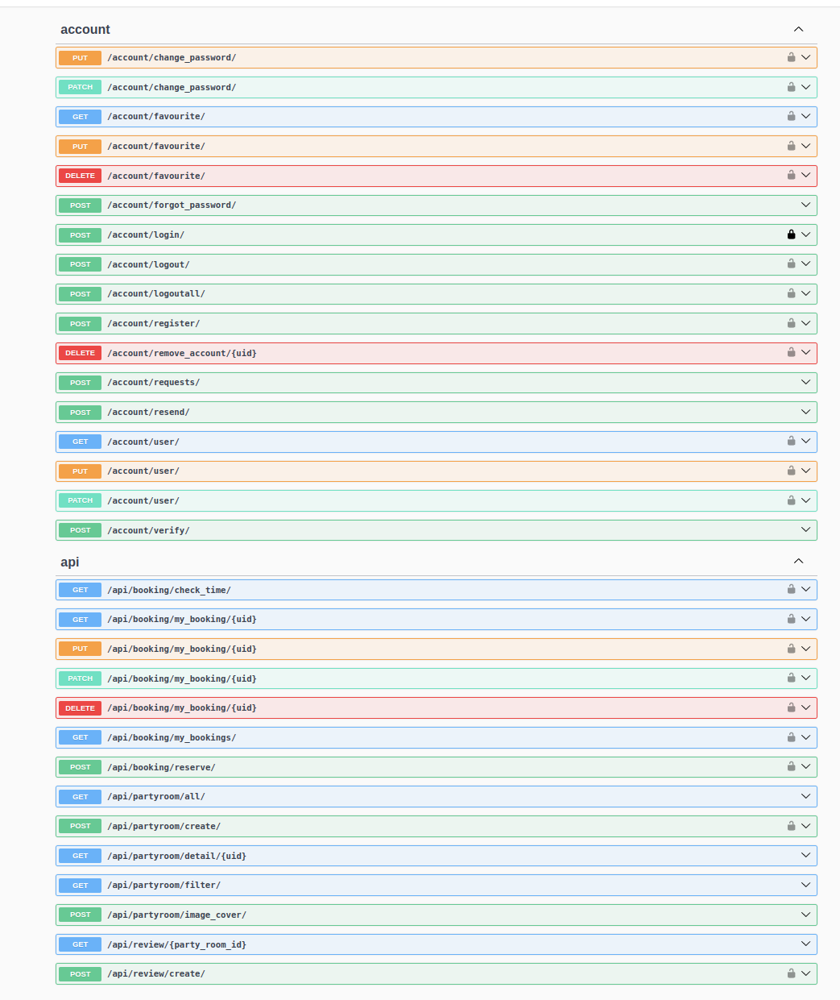

This is a backup of an abandoned project that implements APIs for a partyroom booking system using Django, Django Rest and MySQL.
!

# Set up the environment
1. download python 3.9 and
run `pip install requirements.txt`

2. Then remove and create a new db.sqlite3 in folder partyroom_server

3. Find setting.py in partyroom_server folder

4. goto line 116 uncomment the code 
`DATABASES = {
    'default': {
        'ENGINE': 'django.db.backends.sqlite3',
        'NAME': BASE_DIR / 'db.sqlite3',
    }
}`and **comment the that code use mysql**

5. Under the path partyroom_server, run `python manage.py makemigrations`, `python manage.py migrate`
# Run server
Under the path partyroom_server

run `python manage.py runserver`

If you want to check docs,
goto [docs](http://127.0.0.1:8000/docs)
